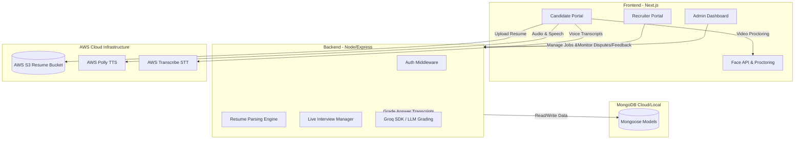

# 🚀 HireX: AI-Powered Hiring Platform
> **Final Year Project (FYP) Software Package & Handover Documentation**
> An advanced recruitment ecosystem that simplifies, automates, and enhances hiring using AI resume parsing, automated skill evaluations, interactive live proctoring, and speech-to-text intelligence.

---

## 📋 Table of Contents
1. [System Architecture](#-system-architecture)
2. [Tech Stack](#%EF%B8%8F-tech-stack)
3. [Key Features](#-key-features)
4. [Prerequisites](#-prerequisites)
5. [Installation & Local Setup](#%EF%B8%8F-installation--local-setup)
   - [Backend Configuration](#1-backend-configuration-hirex-backend)
   - [Frontend Configuration](#2-frontend-configuration-hirex-frontend)
6. [Database Seeding](#-database-seeding-admin-setup)
7. [Default Access Credentials](#-default-access-credentials)
8. [Directory Structure Overview](#-directory-structure-overview)
9. [Troubleshooting & Support](#%EF%B8%8F-troubleshooting--support)

---

## 🏗️ System Architecture



---

## 🛠️ Tech Stack

### Frontend
* **Core Framework:** Next.js 14 (App Router)
* **State Management:** Redux Toolkit (`@reduxjs/toolkit`, `react-redux`)
* **Styling:** TailwindCSS
* **Vision ML:** `face-api.js` (Client-side real-time face tracking & tab-switching proctoring)
* **Charts & Analytics:** `Chart.js` & `react-circular-progressbar`
* **Voice Processing:** AWS SDK (Polly for Text-to-Speech, Transcribe for Speech-to-Text)

### Backend
* **Runtime Environment:** Node.js (v18+)
* **Server Framework:** Express.js
* **Database Object Modeling:** Mongoose / MongoDB
* **Generative AI Orchestration:** Groq SDK (running LLaMA models for AI Grading, evaluation summaries, and feedback generation)
* **Email System:** Nodemailer (integrated with SMTP templates)
* **File Uploads:** Multer & AWS S3 (`@aws-sdk/client-s3`)

---

## 🌟 Key Features

### 👤 Candidate Portal
* **Interactive AI Resume Parser:** Upload a PDF resume to extract skills, career history, education, and calculate a "Resume Strength Score."
* **Smart Proctoring & Face-API:** Real-time browser tab-switching tracking and active camera face-presence analysis during coding and verbal rounds.
* **Multi-Round Interview Room:** 
  - **Verbal/Culture Rounds:** Speech answers processed dynamically using AWS Polly voice rendering and AWS Transcribe.
  - **Coding Round:** Integrated web-editor powered by CodeMirror, supporting syntax highlighting for python, Java, C++, and Javascript.
  - **Aptitude Round:** Time-locked interactive multiple-choice testing.
* **Personalized Dashboard:** Live tracking of application stages (Applied ➔ Shortlisted ➔ Interview Scheduled ➔ Final Decision).

### 💼 Recruiter Portal
* **Job Board Operations:** Create, update, publish, or delete detailed job postings.
* **Custom Interview Templates:** Define token costs, duration, round-specific questions, and required coding tasks.
* **Applicant Screening & Shortlisting:** Visual screening of candidates based on resume match, score levels, and history.
* **Detailed Grading Reports:** View transcripts, full audio logs, browser violations (e.g., tab switches), and AI-generated grading summaries.

### 🛡️ System Administration
* **Platform Health Monitoring:** Track system disputes, candidate feedback submissions, and system-wide stats.
* **Recruiter Verification:** Ability to approve, block, or delete recruiter profiles.

---

## 📋 Prerequisites

Ensure you have the following installed on your machine:
* **Node.js** (v18.x or above)
* **npm** (v9.x or above)
* **MongoDB Community Server** (running locally on port `27017`) or a **MongoDB Atlas Connection URI**.

---

## ⚙️ Installation & Local Setup

### 1. Backend Configuration (`hirex-backend`)
1. Open a terminal and navigate to the backend directory:
   ```bash
   cd hirex-backend
   ```
2. Install the required Node modules:
   ```bash
   npm install
   ```
3. Configure the environment file. A `.env` file is already preset for you. If you need to make changes, ensure the following fields are defined:
   ```env
   MONGO_URI=mongodb://localhost:27017/hirex
   PORT=5000
   BACKEND_URL=http://localhost:5000
   FRONTEND_URL=http://localhost:3000
   SKIP_EMAIL_VERIFICATION=false
   JWT_SECRET="your_jwt_secret_key"
   GROQ_API_KEY="your_groq_api_key"
   EMAIL_USER="your_nodemailer_smtp_email"
   EMAIL_PASS="your_nodemailer_smtp_password"
   AWS_ACCESS_KEY_ID="your_aws_key_id"
   AWS_SECRET_ACCESS_KEY="your_aws_secret_key"
   AWS_REGION="us-east-1"
   AWS_S3_BUCKET="your_s3_bucket_name"
   ```
4. Start the backend development server:
   ```bash
   npm run dev
   ```

---

### 2. Frontend Configuration (`hirex-frontend`)
1. Open a new terminal window and navigate to the frontend directory:
   ```bash
   cd hirex-frontend
   ```
2. Install the client-side dependencies:
   ```bash
   npm install
   ```
3. Configure the environment variables. A `.env` file is already preset for you. Ensure these variables are active:
   ```env
   NEXT_PUBLIC_API_BASE_URL=http://localhost:5000/api
   GROQ_API_KEY="your_groq_api_key"
   AWS_ACCESS_KEY_ID_S3="your_aws_s3_key_id"
   AWS_SECRET_ACCESS_KEY_S3="your_aws_s3_secret_key"
   AWS_REGION_S3="us-east-1"
   AWS_S3_BUCKET_NAME="your_s3_bucket_name"
   AWS_ACCESS_KEY_ID="your_aws_polly_key_id"
   AWS_SECRET_ACCESS_KEY="your_aws_polly_secret_key"
   AWS_REGION="us-east-1"
   ```
4. Start the Next.js development server:
   ```bash
   npm run dev
   ```
5. Open your browser and navigate to `http://localhost:3000`.

---

## 🗄️ Database Seeding (Admin Setup)

To allow the evaluator to login to the **Admin Dashboard**, you need to seed a super administrator account. 

Run the seed script from the `hirex-backend` directory:
```bash
cd hirex-backend
node seedAdmin.js
```
*If successful, you will see a confirmation message indicating `Super Admin seeded successfully!`.*

---

## 🔑 Default Access Credentials

For quick evaluation, you may use the following pre-configured credentials:

| Portal | Email | Password | Access Details |
| :--- | :--- | :--- | :--- |
| **System Administrator** | `admin@hirex.pro` | `Admin@HireX#2026` | Login at `/pages/AdminLogin` |
| **Candidate Portal** | Register a new account at `/pages/CandidateLogin` | *Must follow strong password requirements* | Password requires: 8+ chars, Uppercase, Lowercase, Number, and Special Symbol. |
| **Recruiter Portal** | Register a new account at `/pages/AuthPage` | *Must follow strong password requirements* | Access recruiter controls directly on signup/login. |

---

## 📂 Directory Structure Overview

```text
├── hirex-backend/
│   ├── config/              # MongoDB/Mongoose database configuration
│   ├── api/                 # Utility middlewares for S3 and Groq LLM API
│   ├── middleware/          # JWT and role-based authentication route protection
│   ├── models/              # Schema structures for Candidate, Job, Application, Interview, etc.
│   ├── routes/              # Express API Route controllers
│   ├── utils/               # Nodemailer SMTP setup, validators, and helper functions
│   ├── seedAdmin.js         # Initial script to seed administrator accounts
│   └── server.js            # Entry-point for running the backend
│
├── hirex-frontend/
│   ├── public/              # Static files (images, icons, face-api model weights)
│   ├── src/app/
│   │   ├── components/      # Reusable dashboard widgets, modals, and round managers
│   │   ├── hooks/           # Custom React hooks (e.g. state controllers)
│   │   ├── pages/           # Next.js App Router Page components
│   │   ├── slices/          # Redux Toolkit state slice definitions
│   │   └── utils/           # Frontend API connection endpoints and axios wrapper
└── README.md                # Root Project Documentation (this file)
```

---

## 🔧 Troubleshooting & Support

* **Q: The live interview reports warnings about face-detection?**
  * Make sure to allow webcam permission in the browser when starting the interview. The weights for face models are located inside the `public/models` directory.
* **Q: The Next.js project fails to build or complains about environment files?**
  * Check that your `.env` contains no blank spaces around variables. Verify that `NEXT_PUBLIC_API_BASE_URL` points to `http://localhost:5000/api`.
* **Q: Can I run the project completely offline?**
  * Core frontend, backend, and face detection will run offline. However, the AI resume parsing, speech generation, and transcript grading components require active internet connections to reach out to the Groq API and AWS Cloud endpoints.
